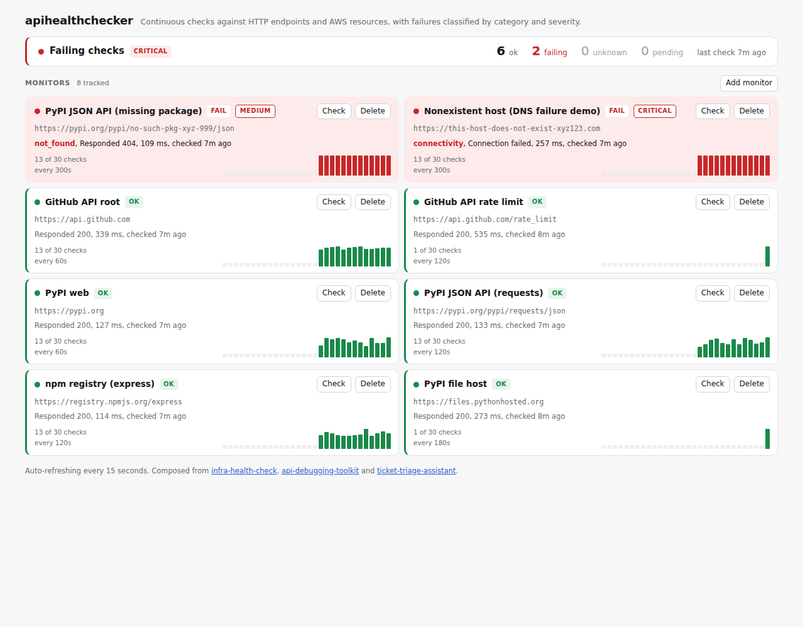

# apihealthchecker

[](https://github.com/alexander-constanza/apihealthchecker/actions/workflows/test.yml)
[](https://github.com/alexander-constanza/apihealthchecker/actions/workflows/deploy.yml)

A monitoring service that continuously checks HTTP endpoints and AWS resources,
records every result over time, classifies failures by category and severity,
and serves a live status page.

**Live demo:** https://apihealthchecker.fly.dev/ ([deployment steps](DEPLOY.md))



The status page above is a real run against live endpoints: six healthy public
APIs, one genuine 404 (a PyPI package that does not exist), and one DNS failure
(a host that does not resolve). The two failures are classified automatically,
`medium / not_found` and `critical / connectivity`, and each monitor keeps a
rolling history strip where bar height encodes latency. A dark variant is at
[docs/screenshot-dark.png](docs/screenshot-dark.png).

The pitch: three earlier repos each do one thing well and stop at the edge of
their own scope. A CLI that runs checks and exits. A Flask app that demonstrates
service patterns. A classifier that sorts text into buckets. This runs them as
an actual service, so a failing check becomes "critical / connectivity, 3
minutes ago" on a page you can leave open, rather than an exit code you have to
be watching for.

## How the three repos compose

```
                         apihealthchecker
                                |
        +-----------------------+------------------------+
        |                       |                        |
  CHECK ENGINE            SERVICE PATTERNS         CLASSIFICATION
  (vendored)                 (ported)                 (ported)
        |                       |                        |
infra-health-check    api-debugging-toolkit   ticket-triage-assistant
        |                       |                        |
 check_http_endpoint    app-factory pattern      scored keyword matching
 check_s3_bucket        JSON structured logs     most-hit wins (category)
 check_ec2_instance     X-Request-Id tracing     most-severe wins (severity)
 run_checks (threaded)  HTTPException split      auditable classifier_used
 CheckResult / Status   /health + deps           adapted to infra vocabulary
 with_retries           400 vs 422 validation
        |                       |                        |
        +-----------------------+------------------------+
                                |
                    scheduler  +  SQLite history  +  REST API  +  status page
```

The flow of one check, end to end:

```
scheduler tick
  -> due_monitors()          which monitors are past their interval
  -> run_checks()            infra-health-check runs them concurrently
  -> CheckResult             status: ok | fail | unknown
  -> classify_failure()      ticket-triage scoring, only if status is fail
  -> check_results row       status + category + severity + latency
  -> notify_transitions()    webhook POST, only if the status changed
  -> GET /api/status         rollup, worst severity
  -> status page             colour-coded card, sparkline, relative time
```

### 1. [infra-health-check](https://github.com/alexander-constanza/infra-health-check) provides the check engine

Nothing here reimplements checking. `apihealthchecker/engine/` is that repo's
`checks.py` and `config.py`, and this service calls its public API:
`check_http_endpoint`, `check_s3_bucket`, `check_ec2_instance`, `run_checks`,
`CheckResult`, `Status`, `with_retries`.

That API was designed for a consumer like this one, and two of its decisions
carry all the way through to the UI:

- **`run_checks(entries, max_workers=...)`** takes the same list of dicts its
  YAML config parses into. This service stores monitors in a table instead of a
  file, renders each row as one of those dicts, and gets concurrency for free.
- **Three-state `Status`**, `ok` / `fail` / `unknown`, is the reason
  `/api/status` counts "could not determine" separately from "failing". A
  malformed URL and a downed service are different problems with different
  fixes, and a status page that shows both as red sends an operator to fix the
  wrong one.

### 2. [api-debugging-toolkit](https://github.com/alexander-constanza/api-debugging-toolkit) provides the service patterns

Ported into `app.py`, `logging_config.py` and `validation.py`:

- **App-factory pattern.** `create_app()` means importing a module has no side
  effects, so tests build an app without starting a scheduler thread.
- **Structured JSON logging.** Fields passed via `extra` become real top-level
  keys (`path`, `status`, `duration_ms`, `monitor_id`, `severity`), so logs are
  filtered on, not regexed.
- **Request-id propagation.** `X-Request-Id` on every response, via
  `before_request` / `after_request`. This version also honours an inbound
  header so an id survives a proxy hop.
- **`HTTPException` handled separately from `Exception`.** Without that split a
  catch-all handler swallows every 404 and returns 500, which lies to the client
  and inflates the error-rate metric. In a monitoring service that is doubly
  bad: the thing watching this service would alert on its own 404s.
- **Validation with a meaningful 400 vs 422 split**, in a module of its own so
  the rules are testable without a request context.

The toolkit's `RUNBOOK.md` also documents, from a real accident, that
per-process state does not survive being run under several gunicorn workers.
That lesson is the direct reason for the scheduler design below.

### 3. [ticket-triage-assistant](https://github.com/alexander-constanza/ticket-triage-assistant) provides classification

`classifier.py` keeps that repo's scoring approach and replaces its vocabulary.

Kept: hit counting rather than first-match, most-severe-wins for severity
against most-frequent-wins for category, confidence as the winner's share of
total hits, and the auditable `classifier_used` field stored on every
classified row.

Replaced: the keyword maps. The original speaks support-ticket language
(invoice, refund, password). This one speaks infrastructure failure language,
matched against a `CheckResult`'s message and detail:

| Category | Matches on | Typical severity |
|---|---|---|
| `connectivity` | connection refused/reset/failed, unreachable, no route to host | critical |
| `dns` | name resolution, getaddrinfo, NXDOMAIN, could not resolve | critical |
| `server_error` | 500, 502, 503, 504, bad gateway, service unavailable | critical |
| `timeout` | timed out, deadline exceeded, read timeout | high |
| `tls` | certificate verify failed, handshake, expired certificate | high |
| `authorization` | 401, 403, access denied, no credentials | high |
| `rate_limited` | 429, throttled, quota exceeded | medium |
| `not_found` | 404, NoSuchBucket, does not exist | medium |
| `client_error` | 400, 405, 409, 422 | low to medium |
| `configuration` | invalid URL, malformed, missing required field | low |
| `unclassified` | nothing matched | low |

Why the scoring matters rather than first-match: a message reading
`"Responded 404. Responded 404 again. Connection failed."` is classified
`critical`, because one connectivity failure outranks repeated 404s. First-match
would report `medium` and an operator would deprioritise a real outage.

Why a 404 is `medium` and not `critical`: a monitor pointing at a URL that no
longer exists is usually a stale config, not an incident. The seed data includes
a real 404 from PyPI specifically to demonstrate that distinction.

The LLM and fallback classifiers from the original are deliberately dropped.
Classifying a check failure is a closed-vocabulary problem over
machine-generated strings, so the rules are exhaustive and a model would add a
network call, an API key and a non-deterministic answer for no gain.

## Vendoring and attribution

The three source repos are portfolio projects, not packages on PyPI, so
`pip install infra-health-check` does not resolve from a fresh clone or inside a
Docker build. Rather than depend on a private index or a git URL that breaks the
moment another repo moves, their code is copied in. This repo stays a single
deployable unit with a plain `requirements.txt`.

Every copied file says so at the top: the source repo, the path within it, why
it was vendored rather than installed, and what was changed.

| Path | Source repo | Relationship |
|---|---|---|
| `apihealthchecker/engine/checks.py` | infra-health-check | Vendored verbatim, import paths rewritten |
| `apihealthchecker/engine/config.py` | infra-health-check | Vendored verbatim, import paths rewritten |
| `apihealthchecker/logging_config.py` | api-debugging-toolkit | Ported verbatim, docstring adapted |
| `apihealthchecker/validation.py` | api-debugging-toolkit | Pattern ported, rules are this repo's |
| `apihealthchecker/app.py` | api-debugging-toolkit | Lifecycle and error handlers ported |
| `apihealthchecker/classifier.py` | ticket-triage-assistant | Scoring ported, vocabulary replaced |

`ruff.toml` excludes `apihealthchecker/engine/` from lint rules that would
rewrite it, so the vendored files stay byte-comparable with upstream and can be
re-vendored by copying them again. Fix check behaviour upstream, then re-vendor.

## The scheduler, and the multi-worker problem

Under gunicorn the app is imported once per worker process, so anything started
at import time starts N times. A scheduler thread is the worst possible thing to
duplicate: every monitor gets checked N times per interval, the results table
fills with near-duplicates, and the monitored endpoints see N times the traffic
they were promised.

This is the same class of bug the api-debugging-toolkit RUNBOOK documents in its
`/simulate/db-down` note. There it was found by accident. Here it is designed
for, with a **lease in the database**, which is the one thing every worker
shares:

1. On startup each worker tries to claim the single row in `scheduler_lock`.
2. The claim succeeds only if the row is absent or its heartbeat is older than
   `LEASE_TIMEOUT_SECONDS` (90s), meaning the previous owner died.
3. The winner runs the loop and rewrites its heartbeat every tick. The losers
   serve requests and stand by, retrying the claim every 15 seconds.
4. If the owner dies, the next standby to retry takes over within the timeout.
   No operator action, no leader-election service.
5. On a clean shutdown the owner deletes its lease row, so its replacement
   claims on the first try instead of waiting out the timeout.

Verified with three real gunicorn workers:

```
scheduler_lease_acquired  owner=demo:26802:f8a045  reason=unclaimed
scheduler_started         owner=demo:26802:f8a045  tick_s=5
scheduler_lease_declined  owner=demo:26803:500d82  held_by=demo:26802:f8a045
scheduler_standby         owner=demo:26803:500d82  retry_s=15
scheduler_lease_declined  owner=demo:26804:3f695f  held_by=demo:26802:f8a045
scheduler_standby         owner=demo:26804:3f695f  retry_s=15
```

An owner id is `host:pid:token`, where the token is random per process. Host
and pid alone turned out not to be unique: on Fly the replacement container
after a deploy got the same pid as the one it replaced, produced the identical
id, and took over the dead owner's lease as though renewing its own. That
happened to be the right outcome, but for the wrong reason, and the same
collision would let two live processes both believe they held the lease.

`GET /health` reports which process owns it, so this is observable in production
rather than a claim in a README.

**Why the losers stand by rather than give up.** The first version tried the
lease once at startup and never again, which is correct only if the process
holding it is guaranteed to outlive you. The first CI deploy to Fly showed it is
not: a deploy replaces the machine, so the new process started while the dead
one's heartbeat was eight seconds old, declined, and never looked again. Checks
stopped, `/health` stayed green, and nothing short of a restart would have
recovered it. Steps 3 and 5 above are the fix. A loser retries until it wins,
and an owner that is shut down cleanly (gunicorn's SIGTERM on deploy) hands the
lease over immediately.

**Being honest about what this is.** It is a lease, not a distributed lock with
fencing tokens. Between a stale heartbeat and the old owner's next tick there is
a window where two loops could briefly overlap. The consequence is a duplicate
row in a results table, which is acceptable. For a payment it would not be, and
this design would be the wrong one.

**What actually ships.** The Dockerfile and `fly.toml` run **one worker with
eight threads**, so there is one process and the lease has nothing to arbitrate.
Threads keep a slow check from starving the status page. The lease exists so
that raising the worker count is a config change rather than an incident.
`APP_ROLE=web` opts a process out entirely, for running the scheduler as its own
process instead.

## Alerting and retention

Two things a monitoring service has to do that recording and displaying do not
cover: tell someone, and stop growing.

**Alerting** is one generic webhook. Set `ALERT_WEBHOOK_URL` and every status
transition is POSTed there as JSON: `ok` to `fail` sends `monitor_failed`,
`fail` to `ok` sends `monitor_recovered`, anything to `unknown` sends
`monitor_unknown`. A monitor that stays down sends one alert, not one per
check. A monitor's very first result sends nothing if it passes and an alert
if it does not.

```json
{
  "event": "monitor_failed",
  "previous_status": "ok",
  "status": "fail",
  "monitor": {"id": 7, "name": "PyPI JSON API", "target": "https://pypi.org/...", "type": "http", ...},
  "result": {"id": 2811, "status": "fail", "category": "server_error", "severity": "critical", "message": "Responded 503", ...},
  "sent_at": "2026-09-06T04:20:11+00:00"
}
```

The POST happens after the result is committed, never inside the transaction,
so a slow or dead webhook costs an alert and never a row. There are no retries
and no queue: `alert_failed` in the logs is the whole record of a missed one.
Every transition is also logged as `monitor_status_changed` whether or not a
webhook is set, so the history of flips is in the logs either way.

It is deliberately not a Slack or PagerDuty integration. Those each want their
own payload shape, and Slack's incoming webhooks in particular reject a body
without a `text` field. Point this at anything that takes JSON, or at a small
adapter in front of whatever actually pages you. `GET /health` reports whether
a webhook is configured, without revealing it.

**Retention** is `RETENTION_DAYS`, default 30. The scheduler's owner deletes
`check_results` rows older than that once an hour, and on its first tick after
a start so a deploy catches up immediately. `0` keeps everything. It is
deletion, not rollup: nothing downsampled replaces what is removed, so "uptime
over the last year" stops being answerable once the window is shorter than a
year. A rollup table is the obvious next step and was left out on purpose, as a
second write path a demo does not need.

## API

| Method | Path | Purpose |
|---|---|---|
| `GET` | `/` | Status page |
| `GET` | `/health` | Liveness plus database reachability and scheduler ownership |
| `GET` | `/api/monitors` | List monitors with current status and recent history |
| `POST` | `/api/monitors` | Create a monitor |
| `DELETE` | `/api/monitors/<id>` | Delete a monitor and its history |
| `POST` | `/api/monitors/<id>/check` | Run one check immediately |
| `GET` | `/api/monitors/<id>/history?limit=N` | Recent results, newest first |
| `GET` | `/api/status` | Rollup: counts by status, worst severity, last check time |

### Examples

```bash
curl localhost:8080/health
```
```json
{
  "status": "ok",
  "dependencies": {"database": "ok"},
  "scheduler": {"running_in_this_process": true, "owner": "287e610c732d58:654:158f1c"},
  "alerting": {"webhook_configured": false}
}
```

```bash
curl -X POST localhost:8080/api/monitors \
  -H 'Content-Type: application/json' \
  -d '{"name": "PyPI JSON API", "target": "https://pypi.org/pypi/flask/json", "interval_seconds": 120}'
```

```bash
curl localhost:8080/api/status
```
```json
{
  "overall_status": "fail",
  "monitor_count": 8,
  "counts": {"ok": 6, "fail": 2, "unknown": 0, "pending": 0},
  "worst_severity": "critical",
  "last_check_at": "2026-09-05T15:08:37.387897+00:00"
}
```

A failing result, with the classification stored alongside it:

```json
{
  "monitor_id": 8,
  "status": "fail",
  "message": "Connection failed",
  "category": "connectivity",
  "severity": "critical",
  "latency_ms": 543.01,
  "detail": {"classifier_used": "rules", "classifier_confidence": 1.0},
  "checked_at": "2026-09-05T15:08:37.387897+00:00"
}
```

### Error handling

No client input produces a 500. Verified against a running instance:

| Request | Response |
|---|---|
| `GET /api/nope` | `404 not_found` |
| `PUT /api/monitors` | `405 method_not_allowed` |
| `POST /api/monitors` with `{bad` | `400 invalid_json` |
| `POST /api/monitors` with `[1,2]` | `400 invalid_json` |
| `POST /api/monitors` with `{}` | `400 missing_fields` |
| `POST /api/monitors` with `"interval_seconds": true` | `422 invalid_field` |
| `GET /api/monitors/1/history?limit=abc` | `400 invalid_parameter` |

400 means the request is wrong. 422 means it parsed but a value is
semantically invalid. Both name the offending field.

## Web UI

One self-contained page at `/`. No CDN, no build step, no external font: all CSS
and JavaScript is inline, so it renders on a machine with no internet access,
which for a monitoring tool is not a hypothetical situation.

- Every monitor as a card, colour-coded ok / fail / unknown / pending
- Latency, relative last-checked time, and check interval
- Failure category and severity shown on failing monitors
- A bar strip of the last 30 results per monitor, height scaled to latency
- A form to add a monitor, and a check-now button per monitor
- Auto-refresh via `fetch` every 15 seconds
- Dark mode via `prefers-color-scheme`

## Running it

### Docker (recommended)

```bash
docker compose up --build
open http://localhost:8080
```

The compose file mounts a named volume at `/data` and sets `SEED_ON_START=1`, so
the demo monitors appear and the scheduler starts checking within a few seconds.

### Local Python

```bash
pip install -r requirements-dev.txt
flask --app apihealthchecker.app seed      # optional, idempotent
flask --app apihealthchecker.app run --port 8080
```

Or under gunicorn, the way it is deployed:

```bash
gunicorn --bind 127.0.0.1:8080 --workers 1 --threads 8 \
  'apihealthchecker.app:create_app()'
```

### Configuration

| Variable | Default | Purpose |
|---|---|---|
| `DB_PATH` | `local.db` | SQLite file path. On Fly this points inside the mounted volume |
| `DATABASE_URL` | derived from `DB_PATH` | Full SQLAlchemy URL. Takes precedence, use it for Postgres |
| `PORT` | `8080` | Listen port |
| `SEED_ON_START` | `0` | Insert demo monitors at boot. Idempotent |
| `RUN_SCHEDULER` | `1` | Whether this process tries to run the scheduler |
| `APP_ROLE` | unset | `web` opts a process out of the scheduler entirely |
| `RETENTION_DAYS` | `30` | Delete check results older than this, checked hourly by the scheduler. `0` keeps everything |
| `ALERT_WEBHOOK_URL` | unset | POST a JSON payload here on every monitor status change. Unset means no alerting |

Everything has a working default, so a fresh clone runs with no configuration
and the same code deploys unchanged.

### Seed data

Seeding is idempotent and never automatic: it runs via the `seed` CLI command or
`SEED_ON_START=1`, because a service that rewrites its own data on every boot is
one you cannot trust with data you put in it.

The eight seeded endpoints are real and were verified reachable before being
committed. Six return 200. The other two are the interesting ones:

- `https://pypi.org/pypi/no-such-pkg-xyz-999/json` returns a genuine 404,
  classified `not_found` / `medium`.
- `https://this-host-does-not-exist-xyz123.com` genuinely fails DNS resolution,
  classified `connectivity` / `critical`.

A status page where everything is always green demonstrates nothing, and one
that fakes its failures demonstrates less.

## Tests

```bash
pytest -v
ruff check .
```

156 tests, no network calls (HTTP is mocked with `responses`), no sleeping. The
scheduler tests pass `now` in explicitly rather than waiting, so a lease can be
aged past its 90 second timeout without the suite taking 90 seconds.

Coverage is deliberately weighted toward the things that bite in production: the
404-stays-404 and 405-stays-405 cases, every validation rejection path, the
lease handoff between workers, the ok/fail/unknown distinction, and that
deleting a monitor actually cascades to its results.

That last one was a real bug found by these tests. SQLite disables foreign key
enforcement by default, which made the `ondelete="CASCADE"` on `check_results` a
decorative comment: SQLAlchemy's `passive_deletes=True` trusted the database to
act on it and SQLite silently did nothing, so every deleted monitor would have
left its results behind forever. `db.py` now turns the pragma on per connection,
and two tests hold that in place.

## Scope and limitations

Honest about what this is not:

- **SQLite, not Postgres.** Fine for one machine and a workload of a few checks
  a minute. It is the reason the deploy runs a single machine: a second one
  would get its own volume and therefore its own separate database. Moving to
  Postgres is a `DATABASE_URL` change, which the code already supports.
- **A lease, not a distributed lock.** See the scheduler section. There is a
  narrow window in which two schedulers could overlap and write a duplicate row.
  Acceptable for monitoring history, not for anything transactional.
- **No authentication.** Anyone who can reach the service can add, delete and
  trigger monitors. Put it behind an auth proxy before exposing it anywhere that
  matters.
- **Alerting is one webhook, fire and forget.** No retries, no queue, no
  routing by severity, no quiet hours. A flapping monitor alerts on every flip.
  Enough to wire into a pager through an adapter, not a paging system itself.
- **Retention is deletion, not rollup.** Rows past `RETENTION_DAYS` are gone
  and nothing summarised replaces them, so long-range uptime numbers are not
  answerable from this database.
- **AWS checks are untested against live AWS.** The engine supports S3 and EC2
  monitors and the API accepts them, but the deployed demo has no AWS
  credentials, so only HTTP monitors are exercised end to end.
- **`create_all` at boot, not migrations.** A schema change against an existing
  database would need alembic.

## Licence

MIT. See [LICENSE](LICENSE).
