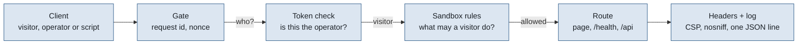
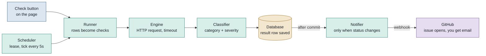
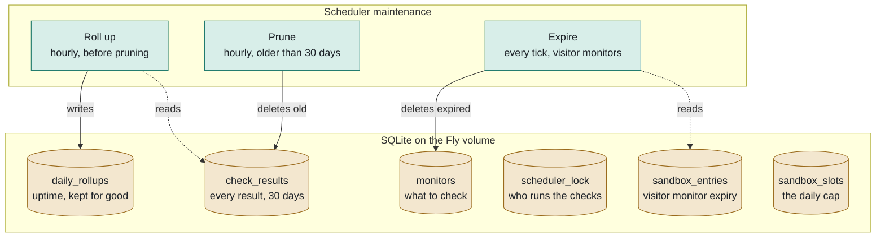
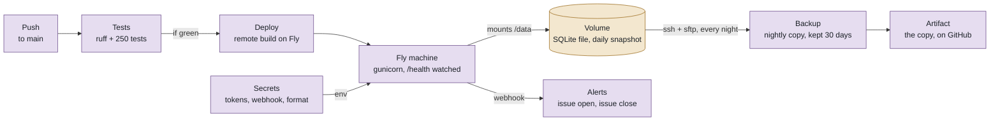

# apihealthchecker on one page

A monitoring service that checks endpoints on a schedule, classifies failures,
keeps history, alerts on change, and runs on Fly.io with CI/CD from GitHub.
Live: https://apihealthchecker.fly.dev/

## Flow chart, in four pieces

Colour says which segment a part belongs to: blue is the request path, green
is checking, amber is data, purple is shipping and operations.

### 1. What happens to a request

### 2. One check, start to finish

### 3. What is stored, and what keeps it tidy

### 4. How it ships and stays safe

## What we did, why, how

**Starting point.** Working service, but CI red on every run, no licence
file, CD never exercised, and a scheduler that died silently on deploy.

**Delivered in one working day, all deployed and verified in production**

- CI/CD: found the root cause of every red run (`pytest` vs `python -m pytest`
  path difference), fixed with one config line, pinned actions to current
  majors and a third party action to a commit, set the Fly deploy token, first
  green deploy end to end.
- Incident found by that deploy: scheduler declined the lease and never retried.
  Root cause analysis from logs, hot fix by restart, permanent fix with standby
  retry, atexit lease release and unique owner ids. Handover verified: zero gap.
- Persistence proven: check history survived seven CI deploys, row counts and
  oldest timestamp compared before and after.
- Backups: Fly snapshots documented, consistent copy via SQLite online backup
  API, nightly GitHub Actions artifact, restore runbook, restore actually
  performed once (see below).
- Retention and rollups: hourly prune, daily rollup table, uptime over 90 days
  on every card, unknown excluded from the ratio and the reason written down.
- Alerting: neutral JSON webhook on status transitions, one alert per outage,
  sent after commit so a dead receiver never loses data. GitHub made the
  receiver: failure opens an issue, recovery closes it, email for free.
- Auth: bearer token on writes, checked in one `before_request` hook so new
  endpoints fail closed, reads open, token asked once in the browser.
- Sandbox mode: visitors add up to three monitors a day, removed after 24
  hours, seeded monitors protected, public targets only, check-now cooldown,
  cap enforced by a unique index so it holds across processes.
- Hardening pass: attacked the service on purpose, nine findings fixed with a
  test each, two left open and documented (redirect follow and DNS rebinding
  in vendored code). CSP with nonces, body limits, header validation.
- Documentation: README as source of truth, DEPLOY.md runbook with verify
  commands for every feature, plain language walkthrough for newcomers,
  screenshots captured from the live page, real alert payload as received.

**Errors handled and what they taught**

- Deploy killed the scheduler while health stayed green: a health check that
  does not check the thing you care about is decoration.
- Owner id collided across deploys (same pid in every container): correctness
  by coincidence is a bug waiting.
- Alert failure log leaked the webhook URL via a traceback: a webhook URL is a
  credential.
- Wrong token pasted twice, then a GitHub token pasted into chat: two tokens
  with different jobs need to be named clearly, and an exposed token gets
  rotated the same hour.
- A verification probe deleted a seeded monitor because a secret had not
  actually been set: read the state flag before sending any write, and keep
  a fresh backup before touching production. Restored from the backup copy.
- Race test passed locally 15 times and failed in CI twice: an in-memory
  database on one shared connection is not a concurrency model; the test now
  uses a real file and a connection per thread, like production.
- Summing a boolean comparison in SQLAlchemy returned `True`, not a count.

**Design decisions, each with a reason in the README**

- SQLite on a volume, not Postgres: one machine, a few checks a minute.
- Lease, not distributed lock: duplicate row acceptable, payment would not be.
- New tables rather than new columns: `create_all` adds tables, not columns,
  so no migration on the live database.
- One shared token, not accounts: an auth proxy's job past this size.
- Generic webhook, not a Slack integration: adapters over favourites.

**Verification habit**

- Every change: ruff, 250 tests, push, watch CI, deploy, curl the live service,
  read logs, compare before and after.

## Keywords for the roles this was built for

Implementation Engineer: deployment, CI/CD, integration, REST API, webhooks,
configuration, migrations avoided by design, customer-facing documentation.

Technical Support Engineer: troubleshooting from logs, root cause analysis,
runbooks, incident timeline, restore from backup, structured logging,
health checks, reproducing a CI-only failure.

Forward Deployed Engineer: shipping to a live environment daily, security
hardening, secrets handling, token rotation, sandboxing untrusted input,
uptime reporting, alert routing into the tools a team already uses.
